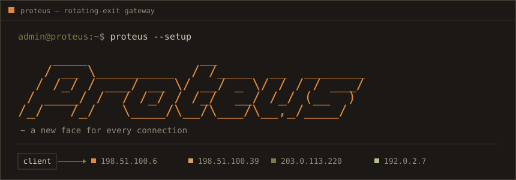
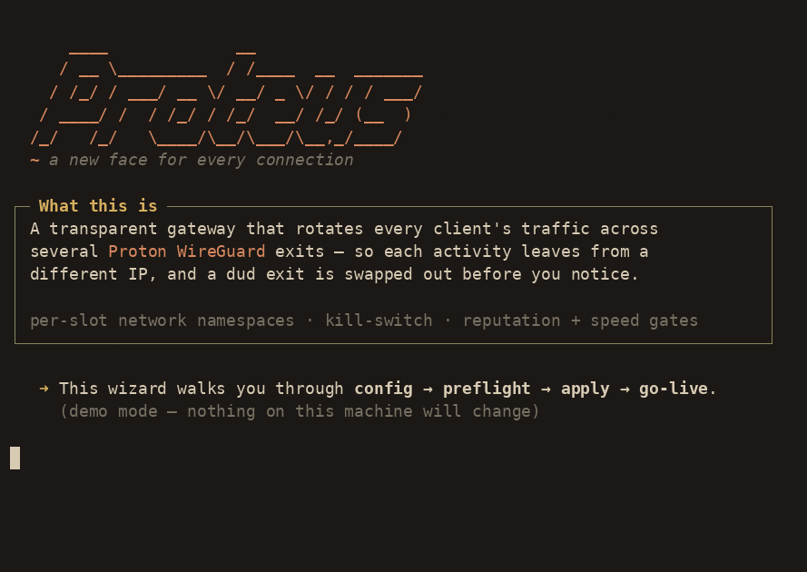
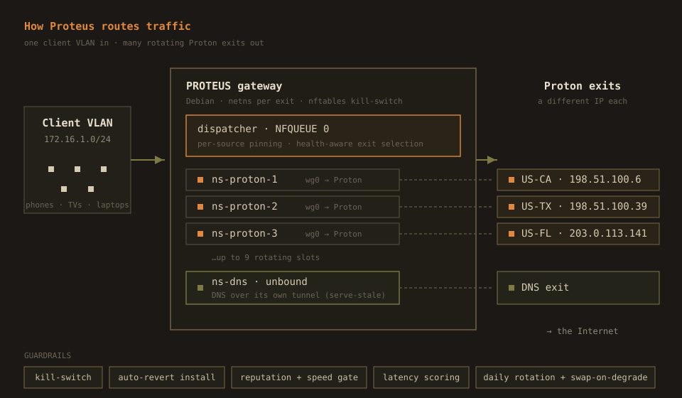

<p align="center">
  
</p>

<p align="center">
  
  
  
  
  
</p>

Proteus is a transparent gateway for a whole VLAN. Point a VLAN's default route at it and every device behind it leaves for the internet through a rotating set of Proton WireGuard exits. Each new activity gets pinned to a healthy exit, a slow or flagged exit is swapped out before you notice, and if a tunnel drops, nothing leaks — traffic that can't reach its assigned exit is dropped, not sent in the clear.

No client software, no per-device config. The devices think they have a normal gateway.

<p align="center">
  
</p>

## Try the walkthrough

The wizard runs the whole setup, and it has a demo mode that changes nothing on your machine:

```bash
git clone https://github.com/nuk3s/proteus.git && cd proteus
./install/proteus --demo      # cinematic walkthrough, no root, touches nothing
```

That is the recording above. When you're ready to install for real on a fresh Debian 13 box:

```bash
sudo ./install/proteus         # config → preflight → apply → go-live, guided
```

The plain scripted path is in `install/README.md`: `install.sh --check`, then `install.sh`, then `install.sh --confirm`.

## How it works

<p align="center">
  
</p>

Each exit lives in its own network namespace with a single WireGuard interface. A namespace can only reach the internet through its tunnel, so a dead tunnel means no egress for that slot rather than a leak. A dispatcher on `NFQUEUE 0` decides which slot a new flow takes: it pins a source to a slot, keeps that flow sticky through a conntrack mark, and skips any slot that warmup has marked unhealthy. DNS gets its own dedicated tunnel so name lookups don't ride the rotating pool and don't fall back to the clear.

A minted exit has to earn its place. Rotation stages the new tunnel in a parallel namespace, waits for the handshake, checks egress, runs a reputation probe (is this IP blocked by the sites people actually use?), and measures throughput against a streaming floor. Only an exit that clears all of that gets promoted; the old one stays up until it does, so rotation never drops live flows.

## What keeps it from stranding you

The install is the dangerous part. It rewrites the firewall and routing on a box you may only reach over SSH. Proteus assumes that and builds in the recovery.

- **Preflight doctor:** before anything changes, it checks that you have two NICs, that IP forwarding is available, that no conflicting namespaces exist, and that the SSH session you're on right now sits inside the management subnet the new rules will keep open. If applying the ruleset would lock you out, it refuses and tells you why.
- **Auto-reverting apply:** the kill-switch and routing go in behind a self-cancelling timer. You open a second SSH session to confirm you still have access; if you can't, you do nothing and the box rolls back to its previous ruleset on its own. Only after you confirm does the install commit.
- **The kill-switch itself:** the main namespace can talk to RFC1918, its WireGuard peers, the Proton control API, NTP, and apt, and nothing else. Every real flow is forced through a tunnel namespace or dropped.

These guardrails came from getting bitten in testing.

## Under the hood

Everything installs under `/etc/multivpn/` and runs as `multivpn-*` systemd units. The pieces that do the work:

| Component | Job |
|-----------|-----|
| `dispatcher.py` | NFQUEUE consumer. Per-source pinning, conntrack-backed stickiness, health-aware slot selection. |
| `rotate-slot.sh` | Mint → stage → handshake → egress → reputation → streaming gate → promote, up to 5 attempts. Old slot stays live until the new one passes. |
| `proton-mint` | Registers a WireGuard key against a cached Proton session and picks a streaming-friendly US exit. |
| `slot-warmup.sh` | Keeps each exit's Proton-side flow state warm and scores slots on latency, jitter, and throughput. Triggers an unscheduled rotation for a slot that keeps failing. |
| `rotate-dns.sh` / `dns-latency-check.sh` | Run and health-check the dedicated DNS tunnel; re-mint it when Quad9 RTT climbs. |
| nftables kill-switch | Default-drop egress with a narrow allow-list, plus the `@vpn_dispatch` / `@wg_peers` / `@proton_api` sets the dispatcher and rotation maintain. |

Slot `N` uses fwmark `N`, routing table `100+N`, and transit `/30` `172.31.N.0/30`; the DNS tunnel takes index 99. Rotation is atomic because dispatch entries reference fwmarks, not endpoints, so a live flow doesn't care that its exit's peer changed underneath it.

## Requirements

- Debian 13 (trixie) or another apt + systemd distro. Debian 13 ships the Proton library (`python3-proton-vpn-api-core`) in `main`; on other distros the installer adds Proton's official repo.
- Two network interfaces: one for management, one facing the client VLAN.
- A Proton VPN account. The one-time login prompts for 2FA; after that, minting is unattended.
- Root on the target. The wizard's `--demo` needs neither root nor an account.

## Notes

Proteus is an independent project and isn't affiliated with or endorsed by Proton AG. It uses Proton VPN through the same client library Proton's own Linux app uses. Internally the stack is named `multivpn`; "Proteus" is the name it wears.
