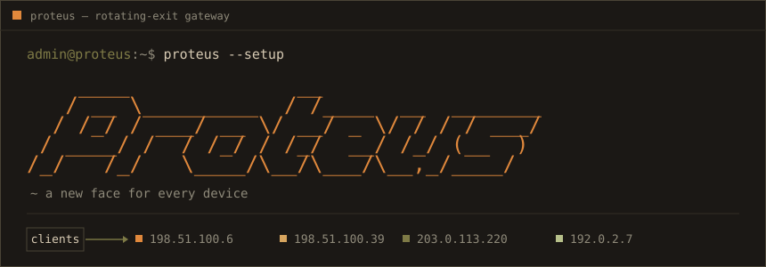
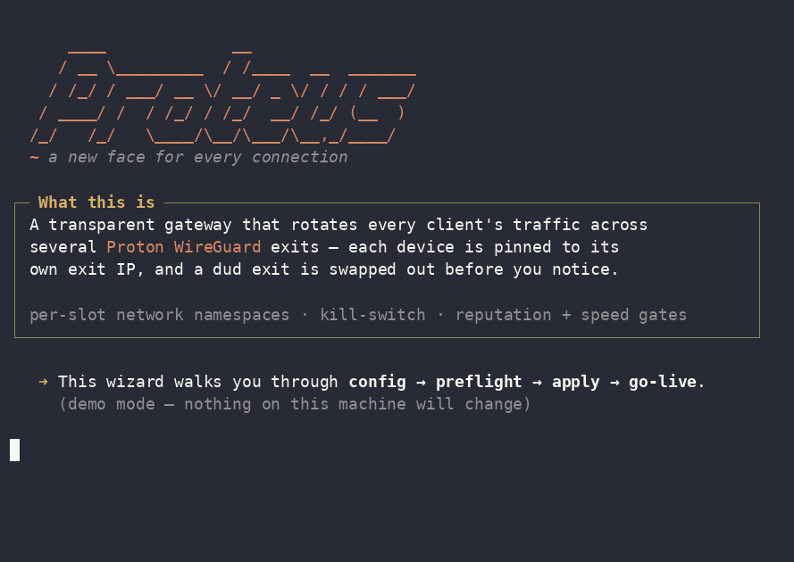
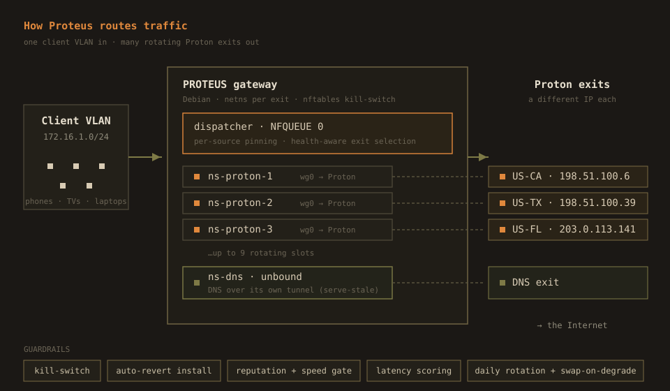
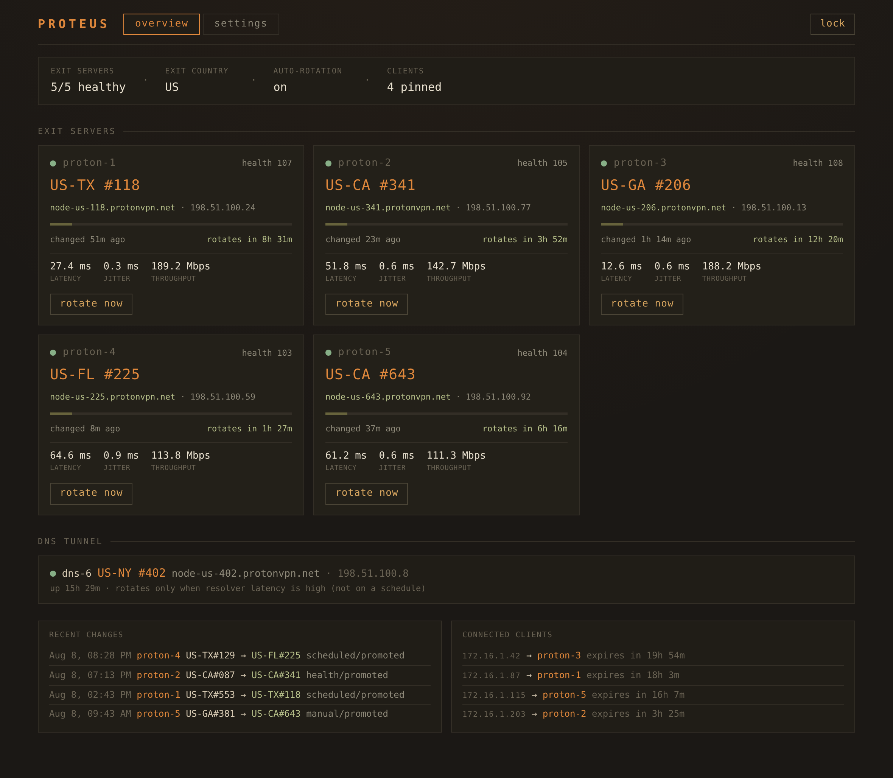
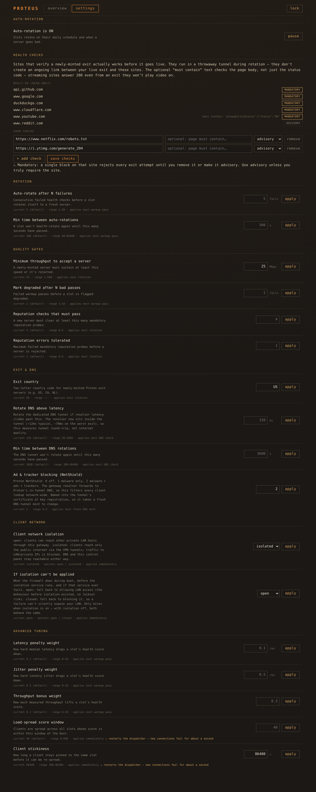

<p align="center">
  
</p>

<p align="center">
  
  
  
  
  
</p>

Proteus is a transparent gateway for a whole VLAN. Point a VLAN's default route at it and every device behind it leaves for the internet through a rotating set of Proton WireGuard exits. Each device gets pinned to its own healthy exit, a slow or flagged exit is swapped out before you notice, and if a tunnel drops, nothing leaks — traffic that can't reach its assigned exit is dropped, not sent in the clear.

No client software, no per-device config. The devices think they have a normal gateway.

<p align="center">
  
</p>

## Try the walkthrough

The wizard runs the whole setup, and it has a demo mode that changes nothing on your machine:

```bash
git clone https://github.com/nuk3s/proteus.git && cd proteus
./install/proteus --demo      # cinematic walkthrough: no root, changes nothing
```

That is the recording above. When you're ready to install for real on a fresh Debian 13 box:

```bash
sudo ./install/proteus         # config → preflight → apply → go-live, guided
```

The plain scripted path is in `install/README.md`: `install.sh --check`, then `install.sh`, then `install.sh --confirm`.

## How it works

<p align="center">
  
</p>

Each exit lives in its own network namespace with a single WireGuard interface. A namespace can only reach the internet through its tunnel, so a dead tunnel means no egress for that slot rather than a leak. A dispatcher on `NFQUEUE 0` decides which slot a new flow takes: it pins a source to a slot, keeps that flow sticky through a conntrack mark, and skips any slot that warmup has marked unhealthy. DNS gets its own dedicated tunnel so name lookups don't ride the rotating pool and don't fall back to the clear.

A minted exit has to earn its place. Rotation stages the new tunnel in a parallel namespace, waits for the handshake, checks egress, runs a reputation probe (is this IP blocked by the sites people actually use?), and measures throughput against a streaming floor. Only an exit that clears all of that gets promoted; the incumbent keeps serving until its replacement has passed every gate, so a failed candidate never thins the pool. The swap itself is brief: flows caught on that slot reconnect through the fresh exit.

## Control panel

A passphrase-gated web UI on `:8443` (TLS, self-signed by the installer) shows what every slot
is doing and exposes the tuning knobs without editing files on the box.

<p align="center">
  
</p>

Each card is one exit: which Proton server it landed on, health score, latency, jitter and measured
throughput, how long until it rotates, and a button to rotate it now. Below that, the dedicated DNS
tunnel, a log of recent swaps and which client is pinned where.

Settings are plain-English rather than environment variables — rotation cadence, quality gates,
exit country, ad/tracker blocking, client isolation, and the health checks a candidate exit has to
pass before it is allowed to serve traffic.

<p align="center">
  
</p>

Health checks are the interesting part. A candidate exit is probed in a throwaway tunnel *before*
promotion, and a check can assert on page content rather than just an HTTP status — which is the
only way to catch a streaming service that answers `200` from an exit it will not actually serve
video to. Mandatory checks reject the exit; advisory ones are recorded and don't gate.

<p align="center">
  
</p>

Screenshots are rendered from synthetic data: exit addresses are RFC 5737 documentation ranges,
client addresses are the project's default RFC 1918 client VLAN (`172.16.1.0/24`).

## The cf ok rule

Many sites sit behind Cloudflare. Cloudflare scores the address a request comes from. When it does
not trust a VPN exit, it shows a challenge page or a block page in place of the site. For a device
on the VLAN that exit is broken, even if its latency and throughput are good.

Proteus checks for this. It loads a few canary sites that sit behind Cloudflare (Discord,
DigitalOcean and Patreon by default, set in `/etc/proteus/canaries.json`). It does this from every
candidate exit before promotion, and from each live exit in turn, about every 17 minutes with five
tunnels. An exit is "cf ok" when no canary challenges or blocks it. Each tunnel card in the panel
shows `cf ok`, `cf N flagged` or `cf unchecked`.

The setting is "Require cf ok" under Quality gates (`PROTEUS_CF_TIER`). It is on by default
(`mandatory`):

- A candidate that fails a canary is never promoted. If no candidate passes, the rotation ends and
  the current exit stays.
- When a live tunnel is flagged, it gets no new clients from that moment. Devices already pinned to
  it stay until a rotation gives it a clean exit, so they change address once.
- A flag gets a second check at the next live-check turn, about three and a half minutes later.
  Two flags in a row start a rotation, at most one per tunnel per hour.
- If no tunnel is cf ok, new clients still get a tunnel and the panel shows a banner. A flagged
  exit is better than no connection.

Set it to `advisory` and the canaries still run and the badges still show, but nothing acts on
them. Use that while you tune your own canary list, or if your exits cannot meet the standard.

I made it the default because the measurements showed the margin to do it. Until October 2026 a
fallback called step-down promoted the best candidate that failed only the canaries when no clean
one turned up. I needed it while I calibrated the canaries and did not know yet how many Proton
exits could pass. In the 25 days before the change, step-down promoted 5 flagged exits, the last
one on 24 September. About 90 different exits met the standard in a week, against a target pool of
20. Each tunnel was flagged for 0.2 to 1.8 percent of that week. So step-down is gone: if no clean
exit turns up, I want the rotation to fail and say so. The off switch stays for a setup where the
standard is out of reach.

I left pinned devices where they are because a change of address in the middle of a session breaks
it. A device that holds a long TLS session, such as a printer that talks to its cloud service, drops
that session when its exit changes. One change, at the rotation, is the minimum. The second check
is there for the same reason: some challenges clear on the next request, and a rotation on a single
flag would move those devices for nothing.

## What keeps it from stranding you

The install is the dangerous part. It rewrites the firewall and routing on a box you may only reach over SSH. Proteus assumes that and builds in the recovery.

- **Preflight doctor:** before anything changes, it checks that you have two NICs, that IP forwarding is available, that no conflicting namespaces exist, and that the SSH session you're on right now sits inside the management subnet the new rules will keep open. If applying the ruleset would lock you out, it refuses and tells you why.
- **Auto-reverting apply:** the kill-switch and routing go in behind a self-cancelling timer. You open a second SSH session to confirm you still have access; if you can't, you do nothing and the box rolls back to its previous ruleset on its own. Only after you confirm does the install commit.
- **The kill-switch itself:** the main namespace can talk to RFC1918, its WireGuard peers, the Proton control API, NTP, and apt, and nothing else. Every real flow is forced through a tunnel namespace or dropped.

These guardrails came from getting bitten in testing.

## Under the hood

Everything installs under `/etc/proteus/` and runs as `proteus-*` systemd units. The pieces that do the work:

| Component | Job |
|-----------|-----|
| `dispatcher.py` | NFQUEUE consumer. Per-source pinning, conntrack-backed stickiness, slot selection that skips unhealthy and flagged exits. |
| `rotate-slot.sh` | Mint → stage → handshake → egress → reputation and canaries → streaming gate → promote, up to 8 verdict attempts. Old slot stays live until the new one passes. |
| `proton-mint` | Registers a WireGuard key against a cached Proton session and picks a streaming-friendly US exit. |
| `slot-warmup.sh` | Keeps each exit's Proton-side flow state warm, scores slots on latency, jitter, and throughput, and re-checks the canaries on live exits. Triggers an unscheduled rotation for a slot that keeps failing. |
| `rotate-dns.sh` / `dns-latency-check.sh` | Run and health-check the dedicated DNS tunnel; re-mint it when the DNS path degrades. |
| nftables kill-switch | Default-drop egress with a narrow allow-list, plus the `@vpn_dispatch` / `@wg_peers` / `@proton_api` sets the dispatcher and rotation maintain. |

Slot `N` uses fwmark `N`, routing table `100+N`, and transit `/30` `172.31.N.0/30`; the DNS tunnel takes index 99. Dispatch entries reference fwmarks, not endpoints, so routing follows a promotion instantly; established connections on the swapped slot re-emerge from the new exit and reconnect.

## Requirements

- Debian 13 (trixie) or another apt + systemd distro. Debian 13 ships the Proton library (`python3-proton-vpn-api-core`) in `main`; on other distros the installer adds Proton's official repo.
- Two network interfaces: one for management, one facing the client VLAN.
- An upstream router that keeps the client VLAN off the internet except through Proteus. Proteus protects only the traffic sent to it. If the router also has an address on the client VLAN (a router that runs DHCP there usually does), block forwarding from that VLAN to the internet on the router, and send no IPv6 router advertisements on that VLAN. Otherwise a device that picks the router as its gateway, or takes IPv6 from it, goes around Proteus. `gotchas.md` shows how to check both.
- A Proton VPN account. The one-time login prompts for 2FA; after that, minting is unattended.
- Root on the target. The wizard's `--demo` needs neither root nor an account.

## Notes

Proteus is an independent project and isn't affiliated with or endorsed by Proton AG. It uses Proton VPN through the same client library Proton's own Linux app uses.
